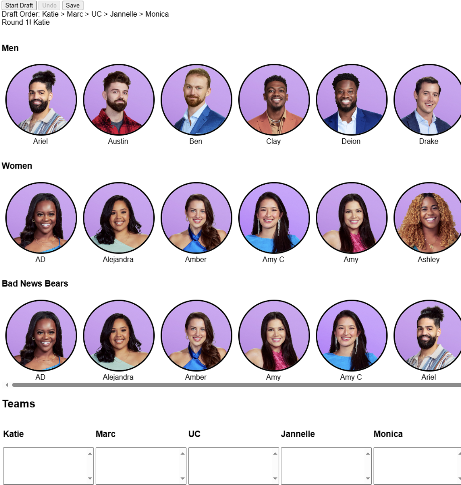
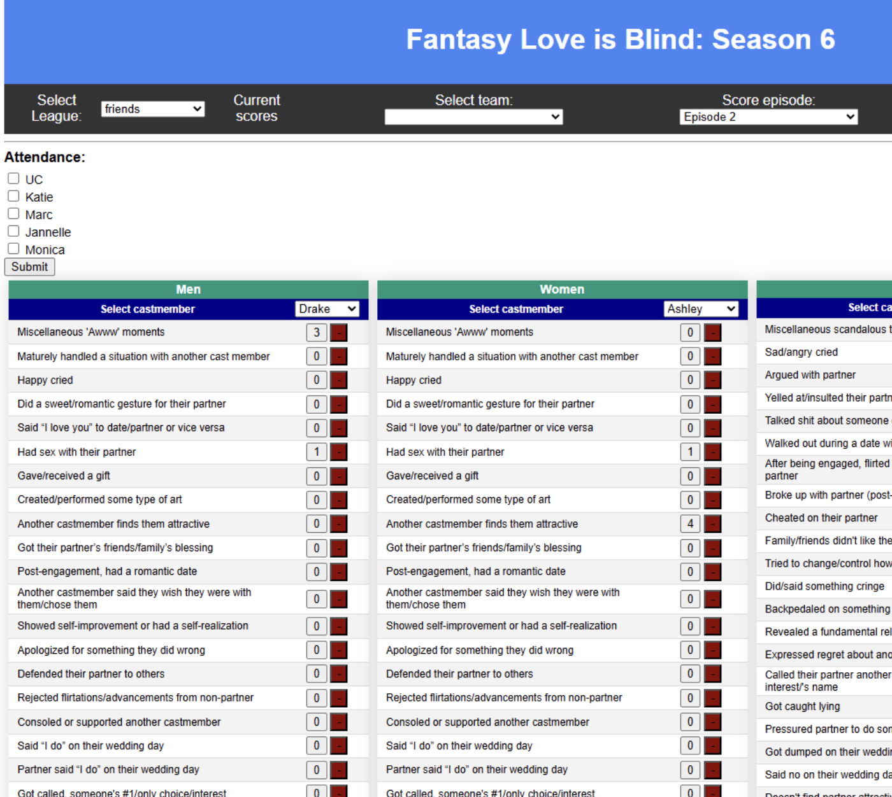
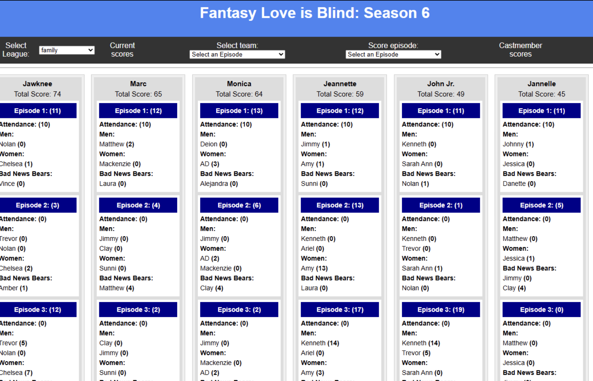
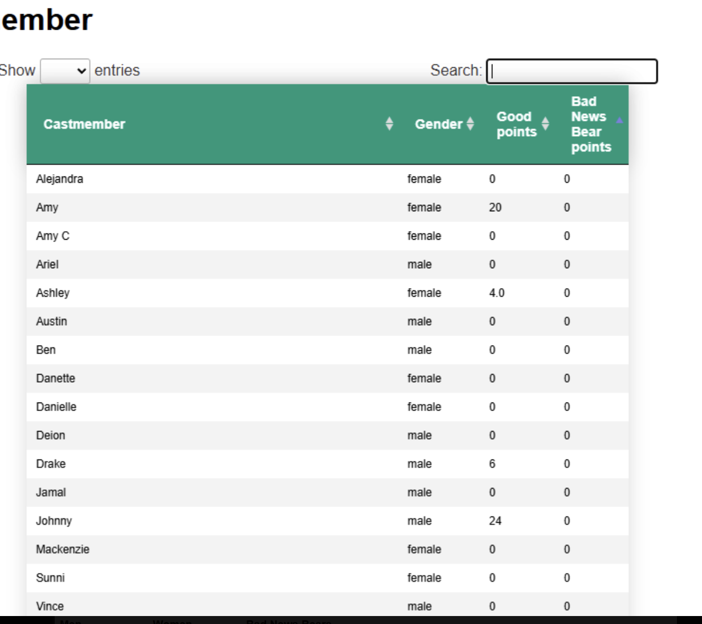

# Love Is Blind Fantasy League

A full-stack web application for managing **fantasy leagues based on the Netflix show *Love Is Blind***.

This project allows players to create leagues, draft contestants, record episode events, and track evolving leaderboards as the season progresses.

I built this project independently to explore **full-stack architecture, relational data modeling, and event-driven scoring systems** (and, because it made it a lot easier for us to play this made-up-fantasy-league-type game!).

---

# Demo

## Drafting Interface

Users draft contestants onto their teams during a live draft.

The system enforces draft order, prevents cast members from being selected more than once, and allowed us to draft cast members into different "positions" depending on if we predicted them to have a favorable or a "messy" outcome.

---

## Episode Event Scoring

Episode events are recorded and translated into scoring updates. My friends/family and I would watch the episodes together remotely and each of us were able to click the corresponding button whenever we felt a cast member was doing a score-worthy activity. This allowed us to discuss whether something "counted" as an activity, as well as watch our points update in real-time.

---

## League Leaderboard

League standings update as episode events are recorded.

Users can view:

- total league standings
- per-episode scoring breakdowns
- individual cast member contributions

---

## Castmember Analytics

The system tracks scoring contributions from each cast member.

This allows users to see which cast member generates the most fantasy points across the season. This was most relevant when we decided to do a re-draft after episode 5, which acted as a "catch-up" mechanic so that players whose teams had exited the show could still compete.

---

# Overview

The application enables users to:

- Create and manage fantasy leagues
- Draft contestants onto teams
- Record episode events
- Automatically update team scores
- View leaderboards and team performance
- Track cast member scoring contributions

The system models the relationships between **leagues, owners, teams, contestants, and scoring events** using a relational database.

---

# Architecture

The application follows a **modular Flask architecture** using the application factory pattern.
